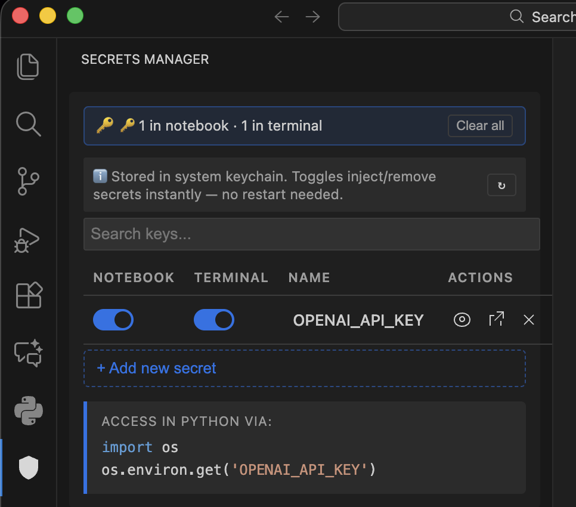

<p align="center">
  
</p>

<h1 align="center">Secrets Manager</h1>

<p align="center">
  <strong>Manage API keys and secrets securely inside VS Code — stored in your system keychain, injected into Jupyter notebooks and terminals on demand.</strong>
</p>

<p align="center">
  <a href="https://marketplace.visualstudio.com/items?itemName=sharad28.secrets-manager">
    
  </a>
  <a href="https://marketplace.visualstudio.com/items?itemName=sharad28.secrets-manager">
    
  </a>
  <a href="https://marketplace.visualstudio.com/items?itemName=sharad28.secrets-manager&ssr=false#review-details">
    
  </a>
  
  
</p>

<p align="center">
  <a href="https://marketplace.visualstudio.com/items?itemName=sharad28.secrets-manager&ssr=false#review-details">
    
  </a>
</p>

---

<p align="center">
  
</p>

---

## Why Secrets Manager?

> Stop hardcoding API keys. Stop juggling `.env` files. Stop restarting kernels.

Secrets Manager stores your credentials in the **OS keychain** and injects them into Jupyter notebooks and terminals **instantly** — with a single toggle. No `.env` files, no restarts, no risk of accidentally committing secrets to git.

---

## Features

### Secure Storage

| | |
|---|---|
| **System Keychain** | Secrets are stored in Keychain Access (macOS), Credential Manager (Windows), or libsecret (Linux) |
| **Never Plain Text** | Nothing is written to your project directory — zero risk of git commits |
| **Input Validation** | Secret names are validated: `letters`, `numbers`, `_` only — must start with a letter or underscore |

### Jupyter Notebook Integration

- Toggle **Notebook** access per secret — injects into running kernels instantly via the Jupyter extension API
- IPython startup watcher (`~/.ipython/profile_default/startup/00_api_vault.py`) ensures secrets are available on every future kernel start
- VS Code's `python.envFile` setting is updated for non-IPython Jupyter kernels
- If the running kernel can't be reached, a **"Restart Kernel"** notification appears with a one-click action

### Terminal Integration

- Toggle **Terminal** access per secret — injects into **all open terminals instantly** (no restart needed)
- New terminals automatically get the value via `environmentVariableCollection`
- Toggling OFF immediately runs `unset KEY` / `Remove-Item Env:KEY` in all open terminals

### UI

- Google Colab-style table: **Notebook** | **Terminal** | **Name** | **Actions**
- Show/hide secret value, copy to clipboard, delete with confirmation
- Search & filter secrets
- Drag-and-drop to reorder
- Compact mode toggle (`Cmd/Ctrl+Shift+C`)

---

## Quick Start

```
1. Install the extension from the VS Code Marketplace
2. Click the Secrets Manager icon in the Activity Bar (sidebar)
3. Click "+ Add new secret", enter a name and value, click Save
4. Toggle Notebook to inject into Jupyter — toggle Terminal to inject into terminals
```

---

## How Secrets Reach Your Code

| Destination | How | Restart? |
|---|---|:---:|
| Jupyter notebook (running) | Executes `os.environ['KEY'] = 'VALUE'` directly in the kernel | No |
| Jupyter notebook (new kernel) | IPython startup script + `python.envFile` | No |
| Terminal (open) | `export KEY=VALUE` sent to all open terminals | No |
| Terminal (new) | `environmentVariableCollection` | No |

**Access in Python:**
```python
import os
os.environ.get('YOUR_SECRET_NAME')
```

---

## Commands

| Command | Shortcut | Description |
|---|---|---|
| `Secrets Manager: Store Secret` | — | Add a new secret |
| `Secrets Manager: Get Secret` | — | Retrieve and copy a secret |
| `Secrets Manager: List Secrets` | — | Open the Secrets Manager panel |
| `Secrets Manager: Focus Search` | `Cmd/Ctrl+F` | Focus the search input |
| `Secrets Manager: Toggle Compact Mode` | `Cmd/Ctrl+Shift+C` | Toggle compact view |
| `Secrets Manager: Clear All Notebook Access` | — | Deactivate all secrets from notebooks |

---

## Security

- Secrets are **encrypted at rest** in the OS keychain
- Input validation prevents injection attacks in secret names
- Secret values are HTML-escaped before rendering
- All generated files are `chmod 600` (owner read/write only) on Mac/Linux
- No secrets are ever stored in your project directory or synced to the cloud

---

## Files Written to Disk

| File | Purpose |
|---|---|
| `~/.ipython/profile_default/startup/00_api_vault.py` | IPython startup watcher — keeps `os.environ` in sync |
| `~/.secrets_manager.env` | Active notebook secrets in `.env` format |
| `~/.secrets_manager_env.sh` / `.ps1` | Shell export file for manual sourcing |

---

## Requirements

- VS Code **1.74+**
- For Jupyter: [Jupyter extension](https://marketplace.visualstudio.com/items?itemName=ms-toolsai.jupyter) (`ms-toolsai.jupyter`)
- For IPython watcher: IPython installed (`pip install ipython`)

---

## Love this extension?

If Secrets Manager saves you time, please consider:

- [**Leave a rating & review**](https://marketplace.visualstudio.com/items?itemName=sharad28.secrets-manager&ssr=false#review-details) on the VS Code Marketplace
- **Star the repo** on [GitHub](https://github.com/sharad28/Secrets-Manager-VScode)
- **Share it** with your team!

Your feedback helps others discover this extension and helps me improve it.

---

## Feedback & Issues

Found a bug or have a feature request? [Open an issue on GitHub](https://github.com/sharad28/Secrets-Manager-VScode/issues)

---

<p align="center">
  Made with care by <a href="https://github.com/sharad28">sharad28</a>
</p>
